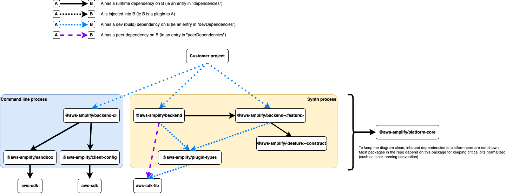
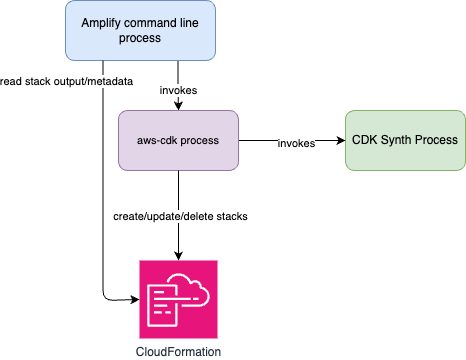
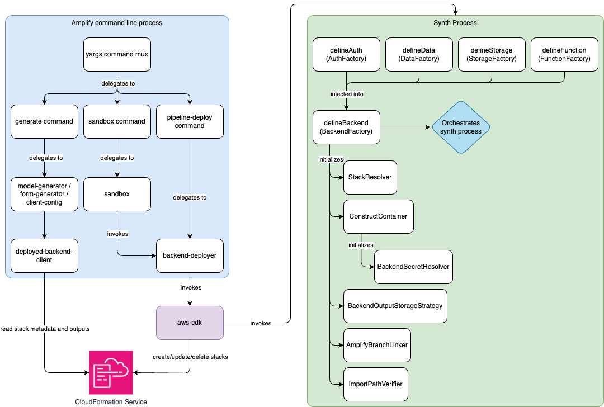

# Context

This document outlines the architecture of the code in this repo. It goes into some detail on the abstractions that we have, what their intent is and how they interact with each other.
This document is NOT meant to be documentation on how to use Amplify Gen2. For that, see [https://docs.amplify.aws/gen2/](https://docs.amplify.aws/gen2/)

This is a living document that will (hopefully) be updated as the project evolves. If you spot something that is incorrect, please open a pull request with an update! And if you are working on a change that will impact the correctness of this document, please include a corresponding change here.

The audience for this doc is anyone that wants a deeper understanding of how the packages in the `amplify-backend` repo work and what design decisions we have made.
If you want to contribute to the project, this document is a great way to get familiarized with what's going on in the codebase. Setting up your dev environment and poking around is another great way! For that see the [Contributing guide](/CONTRIBUTING.md).

# Project Tenets

Tenets are preferences for one way of doing things where the alternative is not necessarily _bad_, but we have chosen to do it a certain way because we think it is more consistent/maintainable/readable/etc.
Tenets are also not dogma. In some situations it makes sense to do something that goes against a tenet.

In no particular order:

1. Composition > inheritance
2. Dependency injection > importing implementations
3. Automated test setup > 100% E2E coverage
4. Copying once > refactoring
5. Refactoring > copying twice
6. Convention > configuration
7. Compile-time failures > runtime failures
8. Simple code > clever code
9. Writing small utilities > pulling in dependencies
10. count(unit tests) >> count(integration tests) >> count(e2e tests) >> count(canary tests)

# Repo tools

We use the following set of tools for managing our code and developer workflows

- [npm](https://github.com/npm/cli) for package management
- [node:test](https://nodejs.org/api/test.html) for testing
- [prettier](https://prettier.io/) for formatting
- [eslint](https://eslint.org/https://eslint.org/) for linting and static analysis
- [changesets](https://github.com/changesets/changesets) for release management
- [typescript](https://github.com/microsoft/TypeScript) for type checking
- [tsdoc](https://tsdoc.org/) for generating docs
- [api-extractor](https://api-extractor.com/) for visualizing the exported surface area of our packages
- [c8](https://www.npmjs.com/package/c8) for collecting test coverage information
- [husky](https://typicode.github.io/husky/) and [lint-staged](https://github.com/lint-staged/lint-staged) for running git hooks

# Repo layout

The `amplify-backend` repo is a monorepo with several packages under the `packages` directory.

We have a `scripts` directory where repo tooling scripts live. All scripts should be written in TypeScript.

The `templates` directory contains some package templates that can be copied into the `packages` directory using `npm run new -- --template=<template name> --name=<new package name>`

The `.changeset` directory contains `changeset` config and change descriptions for unreleased changes. See [changesets](https://github.com/changesets/changesets) docs for more information on this.

The `.github` directory contains our GitHub actions and workflows

The `.husky` directory contains our git hooks

Within the `packages` directory are each of the packages that we publish to npm (except the `integration-tests` package which is not published)

## Dependency graph

The following diagram has a basic dependency graph of the package structure. This graph does not contain every package and dependency in the repo but it gives a general idea of the structure.

At the root, the customer project declares a dependency on `@aws-amplify/backend-cli` and `@aws-amplify/backend`. The backend-cli package depends on several packages for handling various subcommands.

The backend package depends on several feature vertical packages (auth, data, storage, functions). The feature vertical packages implement interfaces defined in plugin-types which the backend package also depends on.

The delination between the packages in the "Command line process" and "Synth process" will make more sense after reading the [Component design](#component-design) section below

# Component design

Becuase Amplify Gen2 _is_ a CDK app, you should have a solid understanding of how CDK works before continuing on. You should understand how the CDK CLI (aws-cdk) invokes the CDK App which is synthesized into CloudAssembly. Then how `aws-cdk` reads and uploads CloudAssembly assets and templates during deployment to S3 and CloudFormation. Some reading material here includes:

- https://docs.aws.amazon.com/cdk/v2/guide/apps.html
- https://docs.aws.amazon.com/cdk/api/v2/docs/aws-cdk-lib.cx_api.CloudAssembly.html
- https://docs.aws.amazon.com/cdk/v2/guide/assets.html
- https://docs.aws.amazon.com/cdk/v2/guide/get_context_var.html

At the highest level, there are four processes at play when running Gen2 local tooling:

1. The Amplify command line process. This process is responsible for parsing command line arguments (we use [yargs](https://yargs.js.org/) for this) and delegating to handlers to execute logic based on the command. Some of the commands create and update stacks and some commands read stack output and metadata that has already been deployed
2. The [aws-cdk](https://github.com/aws/aws-cdk?tab=readme-ov-file#aws-cloud-development-kit-aws-cdk) process which is spawned to perform CDK synth and deploy operations
3. The CDK synth process which is spawned by aws-cdk
4. AWS CloudFormation service is called by aws-cdk after synth to create/update/delete stacks

The following diagram shows the relationship between these high-level components:

Another level deeper, we can look at the components that make up the Amplify command line process and the Amplify part of the CDK Synth Process. aws-cdk and CloudFormation are external dependencies so we won't go into their specifics here.

When executing an Amplify Gen2 CLI command (lets say `npx amplify sandbox`), this first goes to the yargs command parser to figure out what command was run. Yargs delegates to the specific command class which can perform additional command validation and then further delegates to a library that performs the actual logic of the command. In the case of sandbox, we have the `@aws-amplify/sandbox` package that exposes a programmatic interface for controlling the sandbox lifecycle.

Both `sandbox` and `pipeline-deploy` use `@aws-amplify/backend-deployer` under the hood which is responsible for abstracting away the CDK deployment process from the rest of the codebase. The backend deployer constructs IPC calls to `aws-cdk`. `aws-cdk` in turn invokes the CDK App (the code defined at `amplify/backend.ts`) to synthesize the CloudAssembly. It then uploads assets and makes calls to CloudFormation to perform the deployment.

The meat of the Gen2 backend libraries executes whithin the CDK synth process. This is where our orchestration layer translates the Amplify backend definition of `defineAuth`, `defineData`, etc. into CDK constructs that are wired together.

We can now dive deeper into the Amplify-specific things that happen in the synth process.

Under the hood, the backend deployer executes a command like `npx cdk synth --app 'npx tsx amplify/backend.ts' --context amplify-backend-namespace=1234567 --context amplify-backend-name=myBranchName --context amplify-backend-type=branch`. The `cdk synth` command will invoke the `--app` command (`npx tsx amplify/backend.ts`) and pass the context values to the process such that they are availble to CDK constructs in the process. This marks the start of the sequence diagram.

1. The backend definition can contain any number of ConstructFactories. These are the objects created by the `define*` functions (`defineAuth`, `defineFunction`, etc). These objects are essentially callbacks that allow customers to specify the config of the resource as props to the ConstructFactory and then the actual resources are computed later when the orchestration layer executes as part of `defineBackend`
2. The ConstructFactories are passed in as a record to `defineBackend` which initializes the BackendFactory
3. The BackendFactory initializes other class instances needed to perform synthesis. The ConstructContainer is a class that acts as a DI container to hold singleton instances of all of the constructs returned by the ConstructFactories
4. The ImportPathVerifier is a component that can validate that a piece of code was used in an expected location. This is used to verify that `defineAuth` is defined in `backend/auth/resource.ts` and `defineData` is defined in `backend/data/resource.ts`
5. The BackendSecretResolver is used by ConstructFactories that need to resolve secret values at deploy time
6. The OutputStorageStrategy is used by ConstructFactories to set stack output that is needed by client libraries. For example, API endpoints and region config.
7. The BackendFactory parses the CDK context to construct a BackendIdentifier for this deployment. The BackendIdentifier is used to construct stack and parameter names that are unique for each branch (and sandbox) deployment.
8. If the BackendIdentifier is of type branch, we add a custom resource to the root stack to link this stack to the corresponding [Amplify service Branch](https://docs.aws.amazon.com/amplify/latest/APIReference/API_Branch.html)
9. ConstructFactories can declare that they provide certain resources for a given token. This allows other ConstructFactories to look up the resources associated with that token without an explicit dependency on another ConstructFactory. For example, `defineData` can look up auth resources in `defineAuth` without customers having to explicitly configure the connection. In this step, the BackendFactory does a pass over the ConstructFactories to register them to their declared tokens (if any).
10. The BackenFactory now does a second pass over the ConstructFactories to invoke the `getInstance` method on each one. The `getInstance` method takes in the constructContainer instance as well as other context necessary for the ConstructFactories to wire resources in the right way. This essentially kicks off a tree traversal that will walk through all of the ConstructFactories, adding Constructs to the ConstructContainer as it goes. The ConstructContainer has logic to ensure that each factory is only called once.
11. If the ConstructFactory can only be used in a certain file, it computes it's import path
12. It validates this path using the importPathVerifier
13. If the ConstructFactory directly depends on other resources (such as `defineAuth` containing trigger definitions that point to `defineFunction`), it calls the `.getInstance` method on that factory, passing in all of the same context. This is the "tree traversal". If the ConstructFactory depends on resources that it does not have a direct dependency on (such as `defineData` requiring `defineAuth` config without any explicit config), then it asks the ConstructContainer for the resources associated with the token it needs.
14. The ConstructContainer returns the ConstructFactory registered to that token which the original ConstructFactory can now invoke to get the resources it needs.
15. The ConstructFactory invokes `getInstance` on dependency factories
16. Within the `getInstance` method, the ConstructFactory initializes and caches a ConstructGenerator.
17. It then passes this generator to the `getOrCompute` method on the ConstructContainer.
18. The ConstructContainer maintains a cache of constructs based on the generators that it has encountered. If it's a cache hit, it returns the cached construct. If it's a miss, then it invokes the generator function with a CDK scope and secretResolver context
19. If the resource definition contains secrets (such as `defineAuth` having OAuth secret references), the generator can use the secretResolver to get a CDK token for the value that will be resolved at deploy time. Note: secrets are not fetched locally, they are resolved by CloudFormation during deployment
20. The secretResolver places a custom construct in the stack to resolve the value at deploy time
21. The CDK token for the secret is returned to the ConstructGenerator
22. The generator configures CDK L1 and L2 constructs based on the backend config
23. The generator calls the OutputStorageStrategy to store values needed for client config
24. The OutputStorageStrategy sets stack metadata and output for the config
25. The generator returns the initialized CDK construct to the ConstructContainer
26. The container caches the instance
27. The container returns the instance to the ConstructFactory
28. The ConstructFactory returns the instance to the BackendFactory
29. The BackendFactory composes all of the constructs into the Backend object
30. The BackendFactory returns the Backend object to the caller (the `amplify/backend.ts` file)
31. This is the object that customers can then interact with to add overrides and custom resources to their project. From this point, the `backend.ts` file is essentially a "normal" CDK app. L1 and L2 resources can be accessed on the backend object and stacks can be created using `backend.createStack()`.

# Package Manager Support

The library uses `npm_config_user_agent` environment variable to decide which package manager the customer is using.
