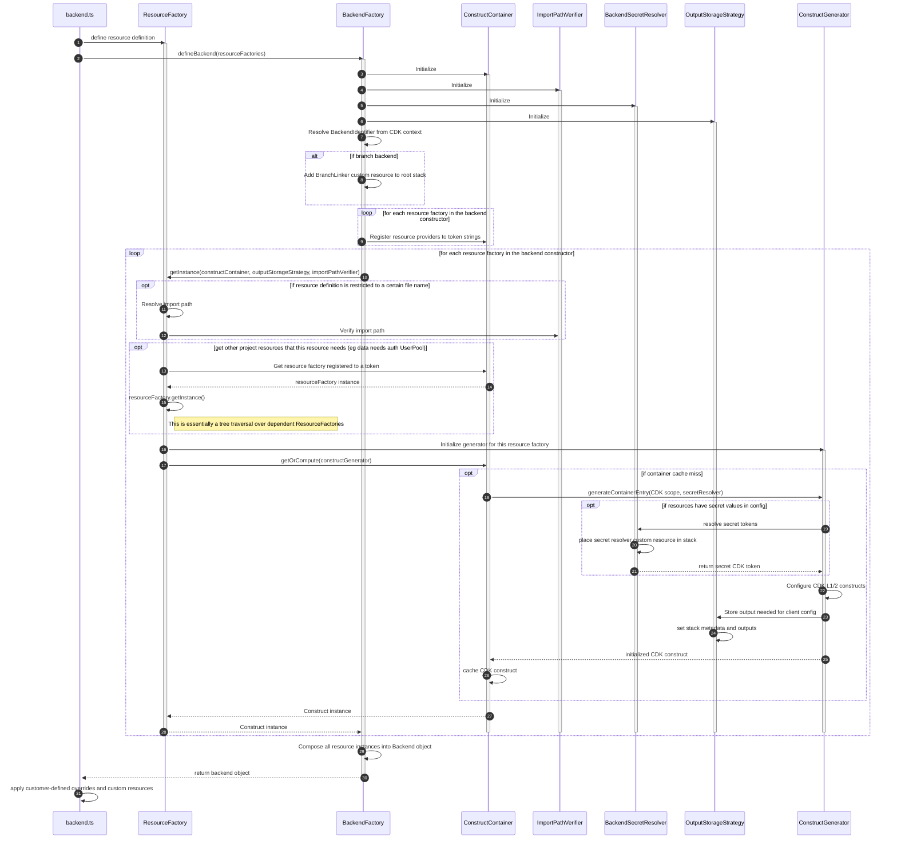

# Context

This document outlines the architecture of the code in this repo. It goes into some detail on the abstractions that we have, what their intent is and how they interact with each other.
This document is NOT meant to be documentation on how to use Amplify Gen2. For that, see https://next-docs.amplify.aws/

This is a living document that will (hopefully) be updated as the project evolves. If you spot something that is incorrect, please open a pull request with an update! And if you are working on a change that will impact the correctness of this document, please include a corresponding change here.

The audience for this doc is anyone that wants a deeper understanding of how the packages in the `amplify-backend` repo work and what design decisions we have made.
If you want to contribute to the project, this document is a great way to get familiarized with what's going on in the codebase (setting up your dev environment and poking around is another great way).

# Project Tenets

Tenets are preferences for one way of doing things where the alternative is not necessarily _bad_, but we have chosen to do it a certain way because we think it is more consistent/maintainable/readable/etc.
Tenets are also not dogma. In some situations it makes sense to do something that goes against a tenet.

1. Composition > inheritance
2. Dependency injection > importing implementations
3. Automating test setup > manual test setup
4. Copying once > refactoring
5. Refactoring > copying twice
6. Convention > configuration
7. Compile-time failures > runtime failures
8. Simple code > clever code
9. Writing small utilities > pulling in dependencies
10. count(unit tests) >> count(integration tests) >> count(e2e tests) >> count(canary tests)

# Repo tools

We use the following set of tools for managing our code and developer workflows

- [npm](https://github.com/npm/cli) for package management
- [node:test](https://nodejs.org/api/test.html) for testing
- [prettier](https://prettier.io/) for formatting
- [eslint](https://eslint.org/https://eslint.org/) for linting and static analysis
- [changesets](https://github.com/changesets/changesets) for release management
- [typescript](https://github.com/microsoft/TypeScript) for type checking
- [tsdoc](https://tsdoc.org/) for generating docs
- [api-extractor](https://api-extractor.com/) for visualizing the exported surface area of our packages
- [c8](https://www.npmjs.com/package/c8) for collecting test coverage information
- [husky](https://typicode.github.io/husky/) and [lint-staged](https://github.com/lint-staged/lint-staged) for running git hooks

# Repo layout

The `amplify-backend` repo is a monorepo with several packages under the `packages` directory.

We have a `scripts` directory where repo tooling scripts live. All scripts should be written in TypeScript.

The `templates` directory contains some package templates that can be copied into the `packages` directory using `npm run new -- --template=<template name> --name=<new package name>`

The `.changeset` directory contains `changeset` config and change descriptions for unreleased changes. See [changesets](https://github.com/changesets/changesets) docs for more information on this.

The `.github` directory contains our GitHub actions and workflows

The `.husky` directory contains our git hooks

Within the `packages` directory are each of the packages that we publish to npm (except the `integration-tests` package which is not published)

# Component design

