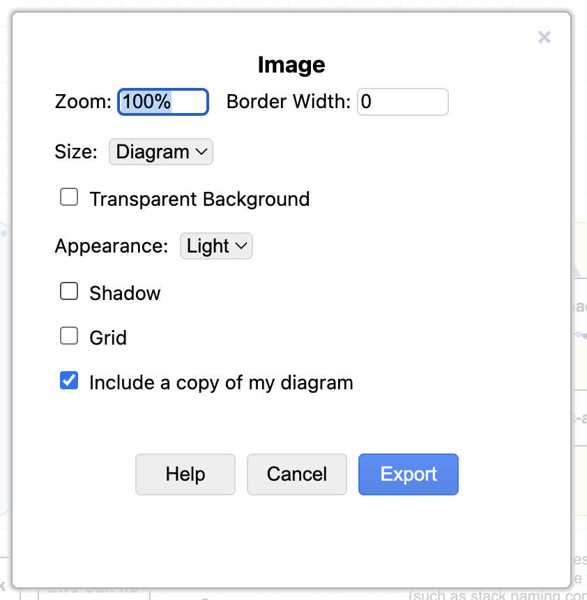

# Description

This file contains assets that can be linked in markdown files within the repo.

Diagrams can be updated by dragging and dropping the .png files into draw.io.
When saving diagram updates back to the repo, be sure to export as a .png and select "Include a copy of my diagram"

